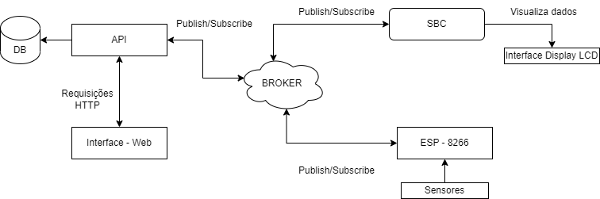
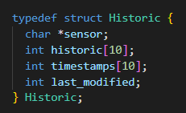
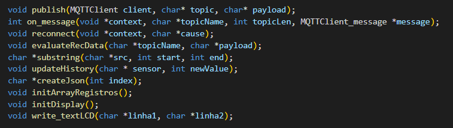
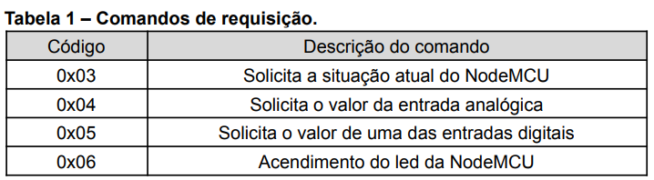

## Problema 3 - IoT: A Internet das Coisas

### Autores
<div align="justify">
    <li><a href="https://github.com/dlucasafj">@dlucasafj</a></li>
    <li><a href="https://github.com/ian-zaque">@ian-zaque</a></li>
</div>

<h1>Indice</h1>
<ol>
    <li>Contextualização do Problema</li>
    <li>Fundamentação Teórica </li>
    2.1. Protocolo de Comunicação <br>
        2.1.1. MQTT <br>
        2.1.2. HTTP <br>
    2.2. SBC <br>
    2.3. Esp8266-NodeMCU
    <li>Resultados e Discussão</li>
    3.1 Arquitetura do Sistema <br>
    3.2 Comunicação SBC - ESP <br>
    3.3 Comunicação SBC - Interface Web
    <li>Conclusão e Considerações
    <li>Referências</li>
</ol>


<h1>Contextualização do Problema</h1>
A internet das coisas (IoT) trata-se de uma rede de objetos físicos do dia-a-dia que, junto a outros dispositivos e sensores, conseguem trocar informações e dados relevantes com outros programas e objetos. Com intuito de evoluir o <a href="https://github.com/ian-zaque/pbl_SD_2">Problema 2</a>, um novo sistema deverá ser implementado com modificações de modo a atender os requisitos presentes anteriormente mas também adequar o programa a IoT, trazendo novas funcionalidades.

Os programas a serem implementados devem ser capazes de ler até 8 sensores digitais, um sensor analógico, verificando estes através do módulo Wifi ESP8266 NodeMCU e interagir com um LED. O sistema deve ser comandado, de forma automatizada, por um Single Board Computer (SBC) que neste contexto será a Orange Pi PC Plus.

A comunicação será iniciada pelo SBC que envia via MQTT (Message Queue Telemetry Transport) os dados de solicitação, por meio de tópicos específicos, para o NodeMCU que responde adequadamente seguindo o protocolo de comandos. Além de monitorar sensores e manipular o LED imbutido do NodeMCU, o sistema deve exibir no display anexo as informações respectivas a requisição realizada, a resposta obtida. Também deve ser incluso na solução do problema uma interface homem-máquina (IHM) que deve exibir os dados dos sensores em formato de gráficos com histórico das 10 últimas medições. Nesta mesma IHM o status da NodeMCU deve constar indicando sua conexão. É possível ler o problema completo <a href="./Problema 3 - IoT A Internet das Coisas.pdf">neste link</a>.

<h1>Fundamentação Teórica</h1>
<h2>Protocolos de Comunicação</h2>
<h4>MQTT</h4>
O protocolo MQTT foi proposto pelo Dr. Andy Stanford-Clark, da IBM, e Arlen Nipper (Eurotech) em 1999. Com o objetivo de desenvolver um protocolo aberto, simples e fácil de implementar. No entanto, o protocolo só se tornou público em 2010 na versão 3.1, disponibilizada pela IBM, e em 2014 veio a se tornar um padrão OASIS com sua versão 3.1.1. 

O MQTT é um protocolo de camada de aplicação que opera sobre o protocolo TCP na camada de transporte. Foi desenvolvido para ser aplicado em ambientes com redes e dispositivos restritos. Seu funcionamento é baseado em uma arquitetura de publicação/assinatura. Neste tipo de arquitetura existem dois elementos principais: o broker e o cliente. O broker pode ser visto como um controlador e é o responsável por coordenar o fluxo de mensagem através dos tópicos, que podem ser vistos como endereços de memória especiais onde as mensagens são enviadas. Os clientes são os nós finais, responsáveis por gerar e consumir os dados.

O funcionamento de sistemas MQTT funciona da seguinte forma: Os clientes se anunciam ao broker, indicando qual é a sua função (publicar ou assinar) e qual o tópico. Em sequência, o broker cria o tópico e gerencia o fluxo de mensagens entre o publicador e o assinante. Tudo feito sobre o protocolo TCP na camada de transporte. 

A comunicação dentro de um sistema MQTT é feita através de troca de mensagens. Essas mensagens do protocolo são compostas por três campos: cabeçalho fixo, variável e o payload. O cabeçalho fixo tem o tamanho fixo de 2 bytes e está sempre presente nas mensagens. Este cabeçalho tem a finalidade de comportar as informações da mensagem como, o tipo, flags de configuração e o tamanho máximo da mensagem. O cabeçalho variável comporta informações de controle, para sinalizar as ações que o broker deve executar. Este cabeçalho existe em alguns tipos de mensagens e está localizado entre o cabeçalho fixo e o payload. Por fim, a mensagem MQTT apresenta um payload, no qual os dados estão contidos. Uma mensagem MQTT pode ter um tamanho máximo de 256 MB. Vale ressaltar que apenas o cabeçalho fixo é obrigatório nas mensagens, os outros campos podem variar de acordo com o tipo da mensagem. 

O protocolo MQTT disponibiliza três níveis de QoS (Quality of Service), que é uma ferramenta que permite determinar quais dispositivos e serviços terão maior prioridade de conexão. Uma mensagem MQTT pode ser configurada para assumir um desses níveis, de acordo com seu nível de confiabilidade de envio e recebimento das mensagens. O nível zero, garante apenas o envio, não se preocupando com o recebimento. O nível um, exige que o recebimento seja confirmado pelo menos uma vez, não impedindo múltiplos recebimentos. O nível dois, garante que a mensagem seja recebida exatamente uma vez, impedindo múltiplos recebimentos. 

O protocolo MQTT apresenta diversas vantagens para IoT, IIoT, e entre essas vantagens esta o baixo consumo de recursos, onde o MQTT tem um baixo consumo de memória, havendo então pouca necessidade de um processamento forte para que o transporte de mensagens seja realizado, também há um baixo consumo de banda. A alta confiabilidade, que é feita através de configurações do QoS e sua alta segurança, onde suas mensagens são protegidas através do uso de certificados SSL, o MQTT suporta diversos tipos de mecanismos para proteção de informações e de autenticações que podem ser configurados com facilidade pelo cliente diretamente no Broker. 

<h4>HTTP</h4>
HTTP (Hypertext Transfer Protocol) é um protocolo que permite a obtenção de recursos como documentos HTML. É a base de qualquer troca de dados na Web e um protocolo cliente-servidor, o que significa que as requisições são iniciadas pelo destinatário, geralmente um navegador Web. Um documento é reconstruído a partir dos diferentes subdocumentos obtidos, como por exemplo texto, descrição do layout, imagens, vídeos, scripts entre outros. 
Clientes e servidores se comunicam trocando mensagens individuais. As mensagens enviadas pelo cliente são chamadas de solicitações (requests) ou requisições, e as mensagens enviadas pelo servidor como resposta são chamadas de respostas (responses). 

<h2>SBC</h2>
Um Single-Board Computer (SBC) é um microcomputador construído sobre uma placa única possuindo um microprocessador, memória de acesso randômico (RAM) e suporte para dispositivos de entrada/saída. A simplicidade de sua arquitetura contribui para um baixo consumo de energia e boa performance de CPU. Atualmente, os SBCs têm sido utilizados em diversos ramos como o de instrumentação médica, computação embarcada e indústria automobilística. Seu tamanho e custo reduzido são as principais vantagens para utilizá-los quando comparados aos tradicionais computadores do tipo desktop. São uma solução rápida e integrada de software e hardware e amplamente utilizados para comunicação entre dispositivos muito específicos como sistemas robóticos e controladores de processos.

<h2>ESP8266-NodeMCU</h2>
O módulo ESP8266 é um microcontrolador da empresa Espressif que trata-se basicamente de um WiFI-SOC, ou seja, ele possui a capacidade de se conectar a uma rede WiFi, pode atuar como uma aplicação stand-alone, onde ele não precisa de nenhum outro componente para funcionar, ou como um servidor escravo MCU (Microcontroller Unit). Na segunda condição ele funciona como um adaptador WiFi para outro microcontrolador, como por exemplo Arduino. 
Em operação o ESP8266 pode funcionar em duas configurações, são elas: access point e client. Na primeira configuração, ele funciona basicamente como um roteador, criando uma rede WiFi restrita por login e senha. Como client, ele estabelece uma conexão com a rede WiFi escolhida, uma vez conectado também cria um servidor e todos os dispositivos conectados na mesma rede WiFi que o ESP8266 têm acesso a este servidor pelo endereço de IP.
Node MCU é um microcontrolador que surgiu para facilitar a construção de projetos utilizando o ESP8266, pois apresenta um regulador de tensão de 3.3V, e com ele não é mais necessário a utilização de outros componentes como adaptadores SPI e UART para realizar a conexão. Ele surgiu logo após o lançamento do ESP8266, sendo lançado com o intuito de ser uma placa para desenvolvimento de projetos de caráter IoT. O NodeMCU pode ser programado através de scripts escritos na linguagem LUA, ou pode ser programado através da linguagem C++, pela própria plataforma do Arduino (Arduino Sketch). 


<h1>Resultados e Discussão</h1>
<h2>Arquitetura do Sistema</h2>
O diagrama a seguir resume o fluxo da solução do problema:



<h2>Comunicação SBC - ESP</h2>
O funcionamento do código da SBC opera na seguinte ordem:
    1. Definição de bibliotecas, variáveis globais, estruturas e protótipos de funções.
    2. Definição de variáveis locais, configuração MQTT e LCD Display.
    3. Inicialização IHM Display, IHM Terminal.
    4. Envio e recebimento automático de comandos e respostas via MQTT.
    5. Verificação e tratamento de respostas.  
    6. Atualização de histórico de medições dos sensores.
    7. Publicação de dados dos sensores e NodeMCU para IHM Web.

###### Passo 1
O ponto 1 engloba apenas configurações gerais mínimas para o funcionamento do programa. Foram feitas as inclusões de bibliotecas de entrada e saída, manipulação de string, temporização, uma específica para interação com o display LCD. Utilizou-se ainda de duas bibliotecas não-nativas que precisaram ser instalados globalmente no dispositivo: 
*wiringPi.h* e a de utlização do protocolo MQTT *MQTTClient.h*. Logo abaixo foram definidas as variáveis globais de composição da blbioteca MQTT, os tópicos para SBC trocar mensagem e os pinos para iniciaçização do Display LCD. Foram criadas também uma variável global de tipo MQTTClient, oriunda da blblioteca de mesmo nome, e uma de tipo int chamada *display_lcd*. Em seguida foi definida uma estrutura (Struct) de nome Historic, contendo neste registro 4 campos: um campo char para guardar o nome do sensor a ser tratado, 2 vetores de 10 posições cada um de tipo int. Um dos vetores chamado historic guarda os valores das dez últimas medições do sensor em questão e o outro armazena o tempo em milissegundos da medição respectiva. Foi instanciado um vetor de 10 posições do tipo struct Historic, uma posição para cada sensor de modo que será inicializado posteriormente na função ``` initArrayRegistros(); ```. Por último, nesta primeira seção, estão os protótipos das funções implementadas (a definição, comentários, documentação e corpo das funções está abaixo, depois do fim da função principal).





###### Passo 2
No ponto 2, já dentro da função main(), estão definidas as variáveis locais usadas para estruturação da conexão MQTT. Nesta seção, fazendo uso da biblioteca *MQTTClient.h *, as configuração do cliente MQTT são criadas e passadas: as funções de reconexão, recebimento de mensagens dos tópicos, ID do cliente SBC, usuáriom senha de autenticação e endereço do Broker. Feita a configuração e havendo conexão com o Broker, pode-se iniciar a subscrição de tópicos e escrita neles. Caso não haja conexão o programa é encerrado, visto que é necessário para o funcionamento geral que haja troca de dados via MQTT. 
Com o MQTT configurado e subscrito no tópico, o próximo passo é inicializar o LCD Display. É realizado o setup de entradas e saídas, através de *wiringPi.h* e *wiringPiDev.h* e em seguida a inicialização dos pinos. O último passo então é inicializar o vetor de histórico *array_registros[10]*, como citado anteriormente.

###### Passo 3
Em seguida, no passo 3, a IHM Display é ativada e começa a exibir as mensagens de apresentação do programa tanto no display quanto no terminal (IHM Terminal) por meio de textos impressos na tela. Assim como a solução do problema 2, as solicitação para o NodeMCU são realizadas automaticamente através de um loop for() que publica no tópico *NODEMCU_PUBLISH_* o comando específico da ação da iteração, seguindo o protocolo definido antes.


O protocolo de requisição ainda conta com mais uma requisição: Desligamento do LED do NodeMcu (Código 0x07). 

###### Passo 4
Neste ponto, o loop for já está iterando e os comandos são enviados na ordem que são apresentadas na tabela 1. As mensagens são enviadas através da função *publish(MQTTClient, char *, char *)*. Existe, porém, uma diferença realizada para a solicitação de sensores digitais: A mensagem enviada possui 2 dígitos, o primeiro indicando que se trata de um sensor digital e o segundo dígito qual sensor digital está sendo requistado valor. Uma outra sutileza nesse loop é que ao chegar no índice 4, o último visto que a condicional do laço de repetição é o índice seja menor ou igual a 4, ele é atualizado para -1, assim o loop será reiniciado e voltará a posição 0 e reiniciará a publicação de mensagens de solicitação.

###### Passo 5
Enquanto o tópico *NODEMCU_RECEIVE* não recebe mensagens, os comandos continuam a ser enviados regularmente. Caso receba alguma mensagem, a função *on_message(void *, char *, int, MQTTClient_message *)*, que foi passada para a configuração MQTT que a todo instante verifica o recebimento, persiste o payload recebido e repassa-o para outra função que analisa o tópico e a mensagem para tratamento correto dos dados e centralização no SBC. Na função _evaluateRecData(char *, char*)_ os dados são avaliados e ajustados para a correta manipulação. Nas respostas do status do NodeMCU, é apenas escrito na IHM Display e enviado para um outro tópico o resultado formatado de acordo com a resposta. Nestes casos a resposta recebida é constituída de 2 caractéres, que denotam o tipo de status recebido, onde '1F' indica que a NodeMCU está com algum problema e '00 ' indica que a situação está ok. 
No caso do sensor analógico, a mensagem recebida é composta por 2 caractéres que denotam o tipo de sensor e os caractéres restantes da string são o valor medido nele (Exemplo: 015, ou então, 01789). É criada uma nova variável que recebe uma substring da mensagem total de modo que receba apenas o valor de medição, é convertido em outra variável para tipo inteiro usando a função _atoi(char *)_. O valor recebido é exibido no IHM Display e enviado para ser guardado no histórico. 
Semelhantemente ocorre com os sensores digitais, a sutileza presente para eles se trata do formato de mensagem recebido. Neste modelo, a mensagem recebida (Exemplo: 02D3987) é composta pelos 2 caractéres de tipo de sensor (Ex.: 02), os próximos 2 caractéres (D3) são indicativos de qual sensor digital foi medido e o restante da string o valor da medição (987). O tratamento também é parecido, onde duas variáveis são criadas: 1 para o nome do sensor e outra para o valor. Seguindo o mesmo procedimento, o valor é convertido para inteiro e repassado para uma outra função que guarda a medição no histórico.

###### Passo 6
Este passo somente é realizado para mensagens recebidas sobre os sensores analógicos e digitais. Neste trecho do programa um índice temporário foi criado junto com uma string que receberá, em notação JSON, os dados escritos do sensor. Esse índice temporário é atribuído o índice pré-incrementado de última modificação do sensor. Deste modo, o campo *last_modified* está sempre atualizado em todos os casos. Caso o campo *last_modified* seja maior ou igual a 9, ele é reiniciado como -1. 
Assim, o valor e o timestamp recebidos sempre ocuparão a mesma posição em seus vetores adequados (De modo que caso queira acessar historico[3], pode-se, com o índice igual, acessar o timestamp correspondente como timestamp[3]). Outra vantagem de usar o *last_modified* é que os valores dos histórico são constantemente atualizados quando o limite de 10 medições é atingido, assim, quanto menor o índice no vetor a mais tempo ele está presente e deve ser o primeiro a ser atualizado.
Após o histórico e o timestamp estarem corretamente atualizados, a função *createJson(int)* é chamada e escreve os valores medidos e tempos numa string de modo a estar formatado em JSON.

###### Passo 7
Continuando o passo 6, com a criação do JSON e dados centralizados na SBC, resta apenas transmitir os dados históricos para a IHM Web. No tópico "SENSORS_HISTORY/nome-do-sensor" a mensagem é publicada e a IHM Web, inscrita nele, recebe a string JSON que a decodifica e transforma em objeto Javascript. Portanto, com a escrita correta do histórico e string formatada, os dados são exibidos em gráficos correspondentes a cada sensor. É importante ressaltar que existe, para cada sensor, um tópico que tem escrito o histórico respectivo a ele. Foi implementado desta forma pois é interessante que se separe os dados individualmente para não existir conflitos entre sensores e evitar incoerência entre os dispositivos e a comunicação MQTT.

O código do SBC está definido <a href="https://github.com/ian-zaque/pbl_SD_3/blob/main/mqtt.c">aqui</a>. Ele é responsável pelo funcionamento e centralização do programa.

<h2>Funções para o SBC</h2>
Foram criadas algumas funções para modularização e consistência do código. Elas estão listadas e descritas abaixo:

###### publish(MQTTClient client, char* topic, char* payload);


<h2>Comunicação SBC - Interface Web</h2>


<h1>Conclusão e Considerações Finais</h1>


<h1>Referências</h1>

